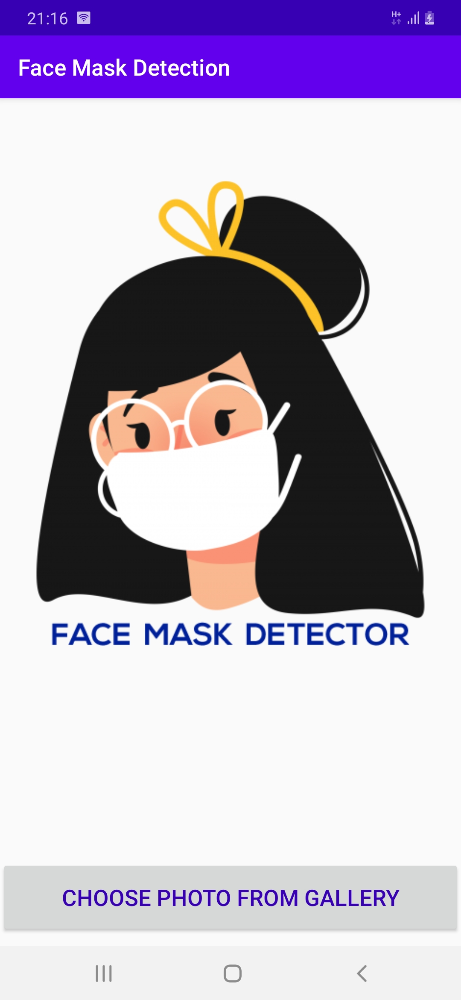
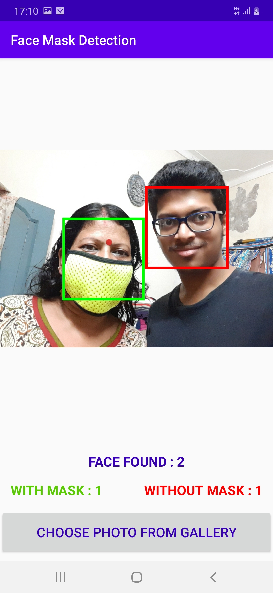
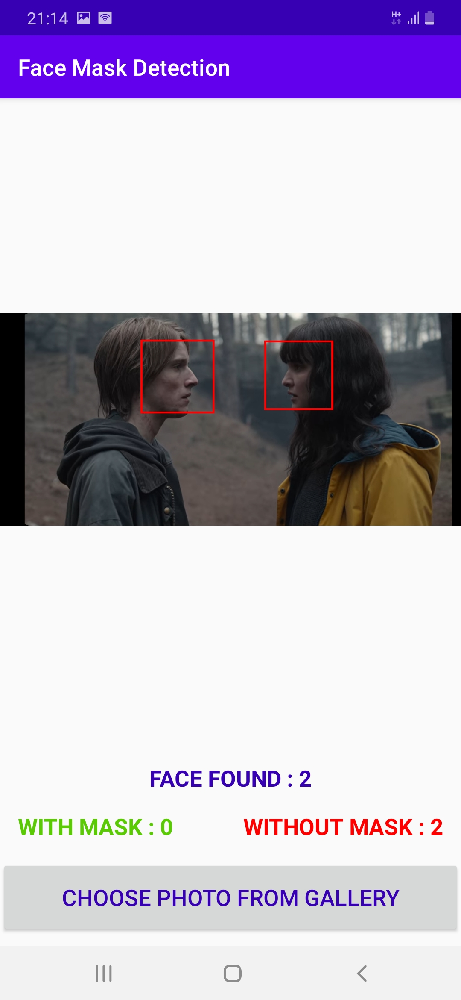
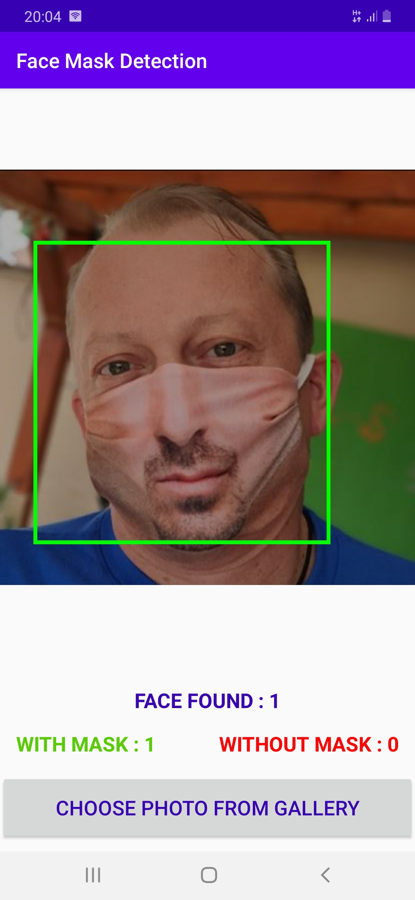

# Face Mask Detector Android App
## Description

In this recent global pandemic, it is very essential to wear a mask while going into crowded place. So it is an Android application which take a picture as input and detectes human faces and classifies them as wearing mask or not.

## Final Product

* The following screenshots are taken from the application. The face detected without mask is enclosed with a red box and a face covered with a mask is enclosed in a green box.

  
  

## Concept used

 Used [Firebase MLKit](https://firebase.google.com/docs/ml-kit) to recognize human faces and then used Auto-ML to train a model which classifies and label human faces as wearing or not wearing mask. 

## Training data

Navigate to [/facedetector](https://github.com/SayantanBanerjee16/FaceMaskDetector/facedetector) folder to view the initial data used for building the TFlite Model.

## Generated TFlite Model

Visit [/TFlite_model](https://github.com/SayantanBanerjee16/FaceMaskDetector/TFlite_model) folder to get the model.
